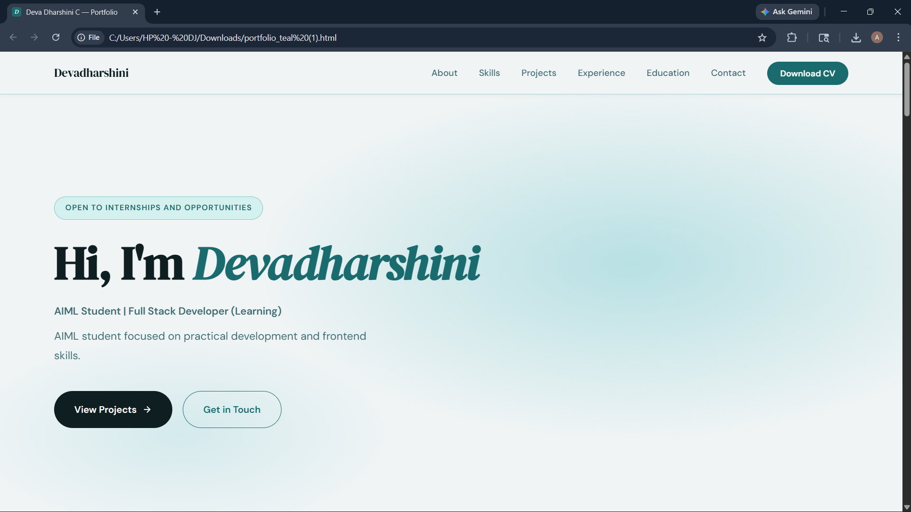
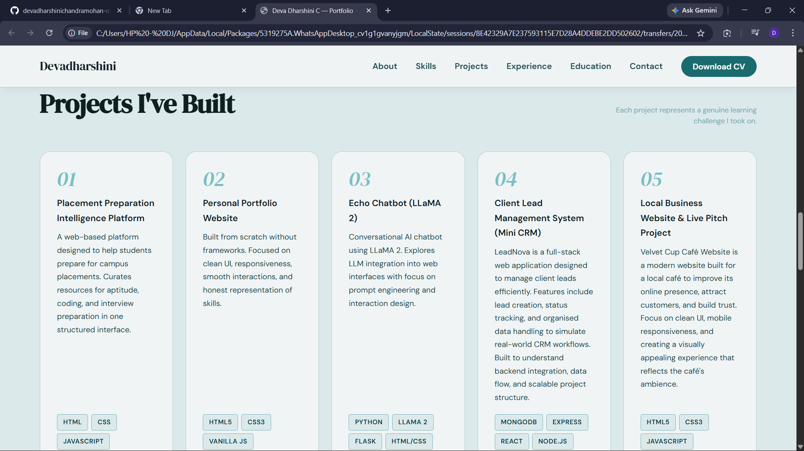
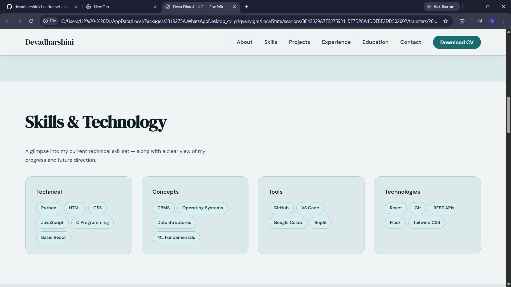
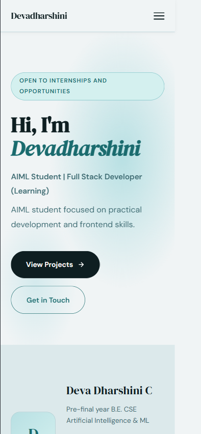

# Full Stack Web Development Internship

## Task 1 – Personal Portfolio Website

# Deva Dharshini — Portfolio

---

## Overview

A responsive personal portfolio website showcasing projects, skills, and experience in Artificial Intelligence and Web Development. Built from scratch with a focus on clarity, structure, and usability.

---

## Tech Stack

* HTML5
* CSS3
* JavaScript

---

## Features

* Responsive layout across devices
* Clean and structured UI
* Smooth navigation and scrolling
* Project showcase with descriptions
* Contact section for communication

---

## Sections

* Hero
* About
* Skills
* Projects
* Experience
* Education
* Contact

---

## Live

https://devadharshinichandramohan-portfolio.netlify.app/

---

## Repository

https://github.com/devadharshinichandramohan-ops/FUTURE_FS_01

---

## Preview

---

## Setup

Clone the repository and open `index.html` in a browser.

---

## Contact

* Email: [devadharshinichandramohan@gmail.com](mailto:devadharshinichandramohan@gmail.com)
* GitHub: https://github.com/devadharshinichandramohan-ops
* LinkedIn: https://www.linkedin.com/in/devadharshini-chandramohan-88546037b/
